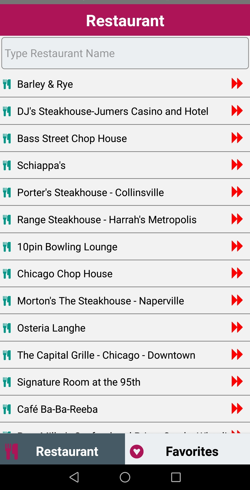
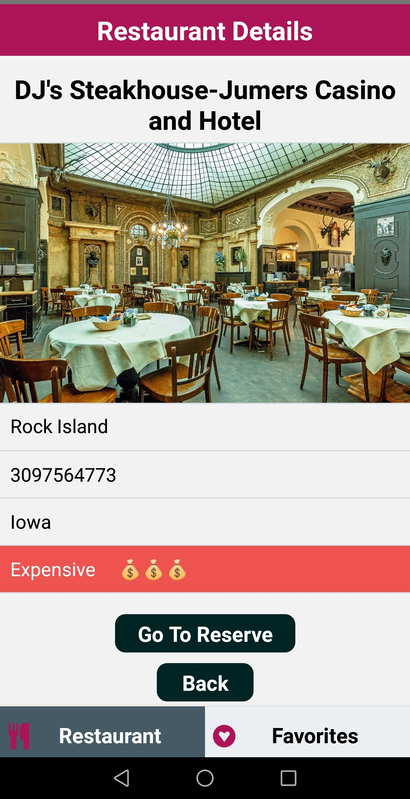
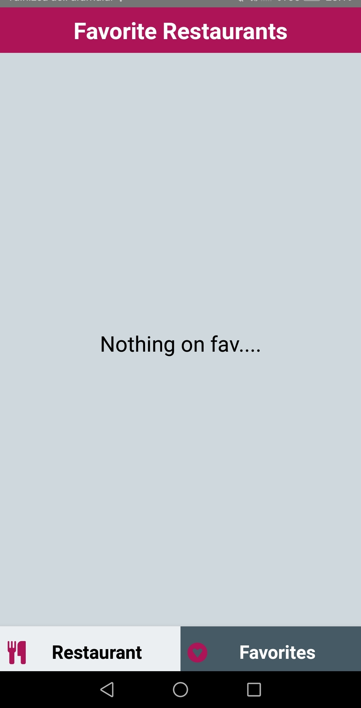
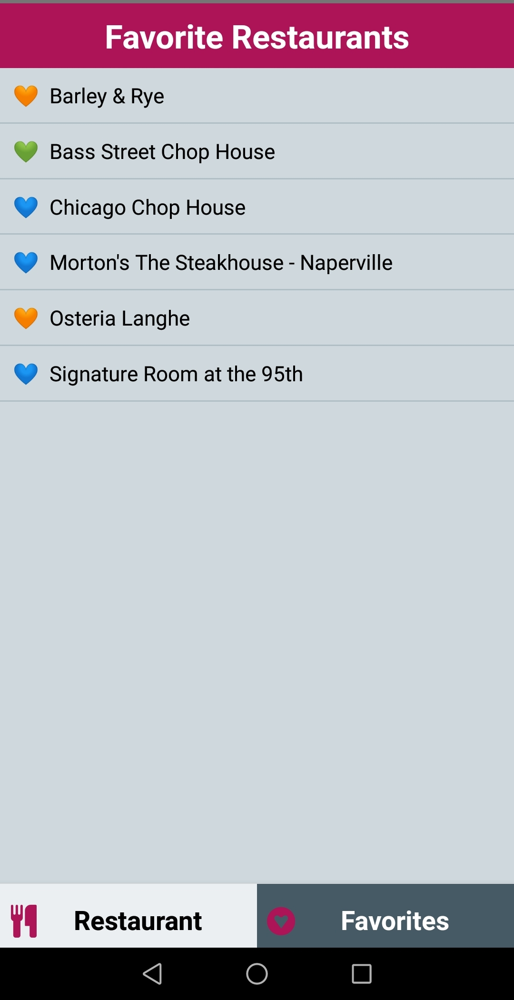
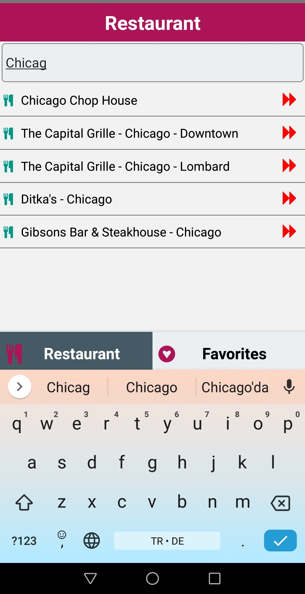

<h1 align="center">Favorite-Restaurants--REDUX--with-React-Native</h1>

## Description

   A work about making an APK with Api and REDUX in React-Native ...

   Eine Arbeit über das Erstellen einer APK mit Api und REDUX in React-Native ...

## This is a short video introduction about this app


## These are short promotional photos about this app

 
 


### At the end of the project, following topics are to be covered;

- HTML
- CSS
- JS
- [React](https://reactjs.org/)
- [React-Native](https://reactnative.dev/)
- [React-Navigation](https://reactnavigation.org/)


## How To Use

To clone and run this application, you'll need [Git](https://git-scm.com) and [Node.js](https://nodejs.org/en/download/) (which comes with [npm](http://npmjs.com)) installed on your computer. From your command line:

```bash

$ git clone https://github.com/Talha-35/Favorite-Restaurants--REDUX--with-React-Native.git

$ npm install

$ npx react-native run-android
```

## PACKAGES

```bash

$ npm install @react-navigation/native (yarn add react-native)

$ npm install react-native-reanimated react-native-gesture-handler react-native-screens react-native-safe-area-context @react-native-community/masked-view 
(yarn add react-native-reanimated react-native-gesture-handler react-native-screens react-native-safe-area-context @react-native-community/masked-view)

$ npm install @react-navigation/stack (yarn add @react-navigation/stack)

$ npm install --save react-native-vector-icons -- with FontAwesome.ttf -- (yarn add @react-navigation/stack)

$ npm install redux (yarn add redux)

$ npm install react-redux (yarn add react-redux)

$ npm install axios (yarn add axios)

$ npm install @react-navigation/bottom-tabs (yarn add @react-navigation/bottom-tabs)

```

## Contact

- GitHub [@Talha](https://github.com/Talha-35)
- Linkedin [@Talha](https://www.linkedin.com/in/talha-%C3%BClk%C3%BCmen-4854391b8/)

